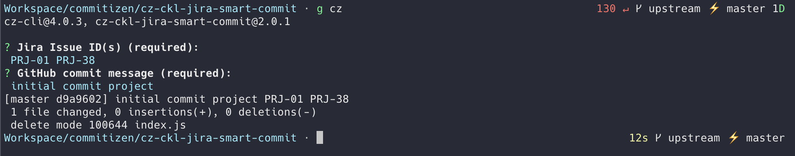

# cz-ckl-jira-smart-commit

A commitizen adapter for [Jira smart commits](https://confluence.atlassian.com/display/FISHEYE/Using+smart+commits).



## Usage

### Global Installation

For a quick global installation of the plugin, simply run the `install.sh` script present in this repo:

```
chmod +x install.sh

./install.sh
```

### Add this adapter

Install this adapter

```
npm install @cheesecakelabs/cz-ckl-jira-smart-commit
```

For usage you can:

- Reference it in your `.cz.json` of your project

```json
{
  "path": "node_modules/@cheesecakelabs/cz-ckl-jira-smart-commit/"
}
```
- Add config inside your `package.json`

```json
{
  /* ... */
  "config": {
    "commitizen": {
      "path": "./node_modules/@cheesecakelabs/cz-ckl-jira-smart-commit/"
    }
  }
}
```

- Use commitizen to init

```
commitizen init @cheesecakelabs/cz-ckl-jira-smart-commit
```

### Day to day work

Instead of `git commit -m 'Your message'`, you type: `git cz` with this adapter and it prompts you for:

- Jira Issue Key(s);
- commit message;

And generates your commit based on that.
